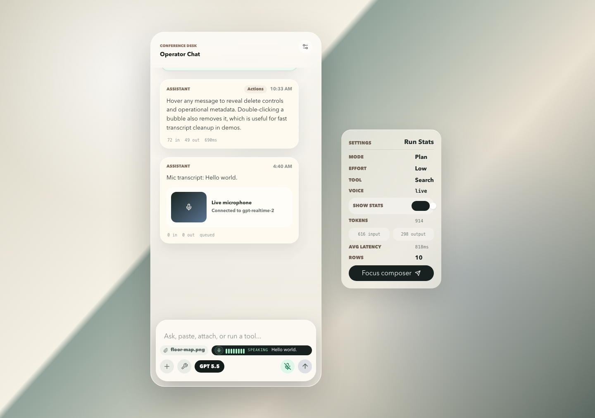

# Public Q&A Chatbot - Best Practices

A comprehensive skill for building unauthenticated, public-facing Q&A chatbot widgets on marketing sites, conference pages, documentation portals, and similar contexts where you need to serve anonymous visitors while controlling cost and abuse.

Distilled from a production implementation powering the [AI Engineer Europe 2026](https://ai.engineer/europe) conference chatbot, with additional chat-scroll lessons from [TanStack Virtual's chat guidance](https://tanstack.com/blog/tanstack-virtual-chat).

For a runnable React/TanStack Virtual demo of long chat scroll behavior plus an expanded bottom command shelf, use `assets/vite-react-tanstack-chat-demo`. The demo includes hover/double-click message controls, subtle token/latency stats, tool-call and multimodal examples, assistant response variants via left/right swipe, and a Realtime voice capture strip with live transcription and an audiogram.



Run the demo locally:

```bash
cd assets/vite-react-tanstack-chat-demo
npm install
npm run dev -- --port 5179
```

To exercise the Realtime voice path, start the dev server with `OPENAI_API_KEY` set. Keep the standard API key on the server side only; the browser should receive an ephemeral Realtime client secret.

## When to use this skill

- Embedding a chatbot widget on a public website (no user login required)
- Answering questions from a known FAQ / knowledge base
- Serving anonymous visitors with LLM-powered responses
- Needing to protect against abuse, cost overruns, and API quota exhaustion
- Building a constrained Q&A bot (not a general-purpose assistant)
- Reviewing a public chatbot's widget UX, streaming behavior, scroll anchoring, or history loading

## Tech stack choices

This skill is written to be tech-agnostic. The reference implementation uses the stack below, but each component is swappable:

| Component | Reference choice | Alternatives |
|---|---|---|
| **LLM provider** | Gemini 3.1 Flash-Lite (via `@ai-sdk/google`) | OpenAI GPT-4o-mini, Anthropic Claude Haiku, Mistral, Llama via Groq/Together |
| **AI SDK** | Vercel AI SDK v6 (`ai`) | LangChain, LlamaIndex, direct provider SDKs |
| **Hosting** | Vercel (serverless functions) | Cloudflare Workers, AWS Lambda, Railway, Fly.io, Render |
| **Rate limiting** | Upstash Redis (`@upstash/ratelimit`) | Cloudflare Rate Limiting, AWS WAF, Redis (self-hosted), Arcjet |
| **Semantic cache** | Upstash Vector + Gemini Embeddings | Pinecone, Weaviate, Qdrant, pgvector, Cloudflare Vectorize |
| **Embedding model** | Gemini `text-embedding-004` (128 dims) | OpenAI `text-embedding-3-small`, Cohere Embed v3, Voyage AI |
| **Observability** | Braintrust (`wrapAISDK`) | Langfuse, Helicone, LangSmith, OpenTelemetry, Datadog LLM Obs |
| **Frontend** | React (inline component) | Vue, Svelte, vanilla JS, Web Components |
| **Long chat virtualization** | TanStack Virtual chat support | Native scroll for short widgets, react-virtuoso, custom virtual list only when already proven |

Do not require virtualization for every public FAQ widget. A short, bounded chat can stay as a simple DOM list. Reach for a virtualized chat list when conversations can grow long, rows have dynamic heights, older history prepends, or streaming output makes scroll anchoring fragile. When using React and a virtualized list is justified, prefer TanStack Virtual's chat support over custom scroll math.

***
## 1. Rate Limiting

### Multi-layer rate limits

Apply limits at multiple granularities to prevent abuse:

- **Per-turn**: Cap messages per conversation (e.g. 9 turns/session)
- **Per-visitor per day**: Cap sessions per IP per day (e.g. 15/day)
- **Global per day**: Cap total sessions across all visitors (e.g. 3000/day)

```typescript
// Example constants
const LIMITS = {
  turnsPerSession: 9,
  sessionsPerVisitorPerDay: 15,
  globalSessionsPerDay: 3000,
};
```

### Use distributed rate limiting in production

In-memory rate limiting resets on every serverless cold start and isn't shared across instances. Use a distributed store for production:

**Upstash Redis (reference):**
```typescript
import { Ratelimit } from "@upstash/ratelimit";
import { Redis } from "@upstash/redis";

const redis = new Redis({ url: REDIS_URL, token: REDIS_TOKEN });
const limiter = new Ratelimit({
  redis,
  limiter: Ratelimit.slidingWindow(15, "1 d"), // 15 per day
  prefix: "chatbot:visitor",
});
const { success } = await limiter.limit(clientIp);
```

**Alternatives:**
- **Cloudflare Rate Limiting** - built into Cloudflare Workers, no external DB needed
- **Arcjet** - drop-in rate limiting SDK with bot detection
- **AWS WAF** - rate-based rules at the edge
- **Self-hosted Redis** - `ioredis` + custom sliding window logic

Always keep an in-memory fallback for local development:
```typescript
const useDistributed = !!redisUrl && !!redisToken;
if (!useDistributed) {
  // Fall back to in-memory Map for local dev
}
```

### Server-authoritative counting

Never trust client-reported turn counts or session flags. The server must count turns from the `messages` array itself:

```typescript
// Server counts turns - never trust client-reported values
const userTurnCount = messages.filter(m => m.role === "user").length;
const isNewSession = userTurnCount <= 1;
```

### Session counting timing

Only increment the session counter **after the server confirms a successful response**, not when the user submits. This prevents phantom session counts from failed requests, network errors, or aborted streams:

```typescript
// Client-side: count after first assistant response arrives
useEffect(() => {
  const hasAssistantMessage = messages.some(m => m.role === "assistant");
  if (hasAssistantMessage && !sessionCounted.current) {
    sessionCounted.current = true;
    incrementSessionCount();
  }
}, [messages]);
```

### Non-new session handling

When a request is not a new session (i.e. a follow-up turn in an existing conversation), skip daily session counter increments entirely. Only the first turn of a conversation should count as a "session" for rate limiting purposes:

```typescript
if (!isNewSession) {
  return { allowed: true }; // Skip session counting for follow-up turns
}
```

### BYOK (Bring Your Own Key) fallback

When rate-limited, let users input their own API key to continue chatting. This turns abuse into the user's own cost while preserving good UX:

```typescript
// Skip rate limiting when user provides their own key
if (!userApiKey) {
  const limit = await checkRateLimit(ip, turnCount, isNewSession);
  if (!limit.allowed) {
    return res.status(429).json({ error: limit.reason, rateLimited: true });
  }
}
const apiKey = userApiKey || serverKey;
```

Provide a direct link to obtain a key (e.g. https://aistudio.google.com/apikey for Gemini, https://platform.openai.com/api-keys for OpenAI).

***
## 2. Security

### Origin validation

Check the `Origin` or `Referer` header against an allowlist. This prevents cross-site request abuse where third parties embed scripts that burn your API quota:

```typescript
const origin = req.headers.origin ?? req.headers.referer ?? "";
const allowedHosts = ["localhost", "yourdomain.com", "vercel.app"];
if (origin && !allowedHosts.some(h => origin.includes(h))) {
  return res.status(403).json({ error: "Forbidden" });
}
```

> **Note:** Substring matching (`origin.includes(h)`) is acceptable for v1 but could theoretically match crafted domains. For stricter validation, parse the URL and compare the hostname.

### Input size limits

Cap both the number of messages and individual message length to prevent token-stuffing attacks that run up your LLM bill:

```typescript
const MAX_MESSAGES = 10;
const MAX_MESSAGE_LENGTH = 2000;

const trimmedMessages = messages.slice(-MAX_MESSAGES).map(m => ({
  ...m,
  parts: m.parts.map(p =>
    p.type === "text" && typeof p.text === "string"
      ? { ...p, text: p.text.slice(0, MAX_MESSAGE_LENGTH) }
      : p
  ),
}));
```

Also limit model output: `maxOutputTokens: 500` for short Q&A answers.

### Validate all parameters

Never trust `as` casts for user-supplied values. Validate against a known set:

```typescript
const VALID_PAGES = new Set(["europe", "home", "worldsfair"]);
if (!VALID_PAGES.has(page)) {
  return res.status(400).json({ error: "Invalid page parameter." });
}
```

### Safe error handling

- Never leak raw SDK error strings to the client (may contain API keys from BYOK)
- Never log full error objects (may contain sensitive data)
- Return generic error messages:

```typescript
} catch {
  console.error("Chat API error");
  return res.status(500).json({
    error: "An error occurred processing your request. Please try again.",
  });
}
```

### IP resolution on serverless platforms

Use the platform's trusted headers. On Vercel: `x-real-ip` > `x-vercel-forwarded-for` > `x-forwarded-for`. The standard `x-forwarded-for` is spoofable by clients.

**Alternatives:**
- **Cloudflare:** `CF-Connecting-IP`
- **AWS ALB/CloudFront:** `X-Forwarded-For` (first IP is trustworthy when set by AWS)
- **Fastly:** `Fastly-Client-IP`

### Disable non-text modalities

If you only need text responses, explicitly restrict the model:

```typescript
const model = provider("gemini-3.1-flash-lite", {
  responseModalities: ["TEXT"], // Gemini-specific
  // For OpenAI: modalities: ["text"]
});
```

Also state "text-only assistant" in the system prompt as a defense-in-depth measure.

***
## 3. Cost Optimization

### Semantic caching

Use vector similarity search to cache and reuse responses for semantically similar questions. Most effective for FAQ-style chatbots where users ask the same questions in different words.

**Upstash Vector (reference):**
```typescript
import { Index } from "@upstash/vector";

const vectorIndex = new Index({ url: VECTOR_URL, token: VECTOR_TOKEN });

// Lookup: check cache before calling LLM
const results = await vectorIndex.query({
  vector: await getEmbedding(question),
  topK: 1,
  includeMetadata: true,
  filter: `page = '${page}'`,
});
if (results[0]?.score >= 0.92 && results[0]?.metadata?.answer) {
  return results[0].metadata.answer; // Cache hit - skip LLM call
}

// Store: cache after LLM responds (fire-and-forget)
void vectorIndex.upsert({
  id: `cache-${Date.now()}`,
  vector: embedding,
  metadata: { question, answer, page, cachedAt: Date.now() },
});
```

**Key decisions:**
- **Similarity threshold**: 0.92+ to avoid returning wrong cached answers. Lower values increase hit rate but risk incorrect responses.
- **Embedding dimensions**: 128 dims is sufficient for FAQ similarity and cheaper to compute/store than full 768/1536/3072.
- **Cache scope**: Cache first-turn questions only (highest hit rate, simplest implementation).
- **TTL**: 7 days is reasonable; stale answers are better than no cache.

**Alternatives:**
- **Pinecone** - managed vector DB with metadata filtering
- **pgvector** - if you already have PostgreSQL
- **Cloudflare Vectorize** - edge-native, pairs with Workers
- **Qdrant/Weaviate** - self-hosted or cloud, richer query capabilities

### Cache TTL enforcement

Always store a `cachedAt` timestamp in cache entry metadata. On lookup, reject entries older than your TTL (e.g. 7 days). This prevents stale answers from persisting indefinitely, especially when FAQ content changes:

```typescript
const CACHE_TTL_MS = 7 * 24 * 60 * 60 * 1000; // 7 days
if (Date.now() - result.metadata.cachedAt > CACHE_TTL_MS) {
  // Stale - treat as cache miss
}
```

### Stream protocol consistency for cache hits

When returning a cached response, use the **same streaming protocol** as live LLM responses. Don't switch to a different response format (e.g. manual Data Stream Protocol vs. UI Message Stream). Inconsistent formats cause client-side parsing errors and broken UX:

```typescript
// BAD: different format for cache hits
res.write(`0:${JSON.stringify(cachedText)}\n`); // Manual Data Stream Protocol
// GOOD: same format for both paths
const stream = createUIMessageStream({ /* ... */ });
pipeUIMessageStreamToResponse(stream, res);
```

### FAQ list view

Offer a browsable FAQ list alongside the chat interface. This serves users who have common questions without making any LLM calls at all:

```typescript
// Structured FAQ data for UI rendering
export const FAQ_QUESTIONS: Array<{
  category: string;
  question: string;
  answer: string;
}> = [
  { category: "Ticketing", question: "Can I get a refund?", answer: "Yes, per our refund policy..." },
  // ...
];
```

Organize by category with expandable sections. Clicking a question can either show the pre-written answer directly or send it to the chat for a more detailed LLM response.

### Use the cheapest sufficient model

For a constrained Q&A chatbot, you rarely need the most powerful model:

| Model | Input cost | Output cost | Best for |
|---|---|---|---|
| Gemini 3.1 Flash-Lite | $0.25/1M | $1.50/1M | Cheapest, good for FAQ |
| GPT-4o-mini | $0.15/1M | $0.60/1M | Good balance of cost/quality |
| Claude Haiku | $0.25/1M | $1.25/1M | Fast, good at following instructions |
| Llama 3.3 70B (via Groq) | Free tier available | Free tier available | Cost-sensitive prototypes |

### Short output limits

Set `maxOutputTokens` to the minimum needed (e.g. 500 tokens for 2-4 sentence answers). This caps cost per request and keeps responses concise.

### Context caching

Pre-build and cache the system prompt context at module level. This avoids re-computing expensive string concatenations on every request:

```typescript
let cachedContext: Record<string, string> | null = null;

function buildContext(): Record<string, string> {
  if (cachedContext) return cachedContext;
  // ... expensive computation ...
  cachedContext = result;
  return cachedContext;
}
```

***
## 4. Observability

### Trace every LLM call

Instrument all LLM calls with input/output, latency, token usage, and cost. This is essential for monitoring abuse, debugging, and cost tracking.

**Braintrust (reference):**
```typescript
import { initLogger, wrapAISDK } from "braintrust";
initLogger({ projectName: "my-chatbot", apiKey: BRAINTRUST_API_KEY });
const { streamText } = wrapAISDK(ai); // Auto-traces all calls
```

**Alternatives:**
- **Langfuse** - open-source, self-hostable, supports OpenAI/Anthropic/custom
- **Helicone** - proxy-based, zero-code integration
- **LangSmith** - if using LangChain
- **OpenTelemetry** - vendor-neutral, export to Datadog/Honeycomb/Grafana
- **Datadog LLM Observability** - if already using Datadog

### Log semantic cache hits

Track cache hit rates to understand cost savings and tune the similarity threshold. A cache hit is a "free" response that saved an LLM call.

### Don't log sensitive data

Avoid logging full error objects, API keys, or user PII. Log just enough to debug (error type, status codes, IP hashes).

***
## 5. UX Patterns

### Markdown rendering

Enable markdown in chat responses and instruct the model to use it via the system prompt:

```text
You may use markdown formatting in your responses when appropriate:
- Use **bold** for emphasis on key information like dates, prices, or venue names
- Use [links](url) when referencing websites
- Use bullet points for lists of speakers, sessions, or options
- Keep formatting light and readable
```

**React:** `react-markdown` + `remark-gfm`
**Vue:** `vue-markdown-render`
**Vanilla JS:** `marked` or `markdown-it`

### Draggable and resizable window

Let users reposition and resize the chat window. Persist geometry to `localStorage` so it survives page reloads. Clamp positions to viewport bounds:

```typescript
const newX = Math.max(0, Math.min(
  e.clientX - dragOffset.x,
  window.innerWidth - geometry.width
));
```

### Streaming responses

Always stream responses for perceived speed. Use your SDK's streaming API rather than waiting for the full response. The first token appearing quickly matters more than total latency.

For the UI, update one in-progress assistant message as tokens arrive. Do not append a new message row per token. Token-level rows are expensive, break transcript semantics, and make scroll anchoring harder.

### Chat scroll and virtualization

Public Q&A widgets often start short, so a plain scroll container is fine until there is evidence it is not. Add virtualization when the widget can hold long histories, rich markdown, tool results, images, code blocks, history pagination, or token-streaming messages that grow in height.

When virtualization is warranted, recommend TanStack Virtual's chat support for React implementations, but keep it optional and swappable. The important lessons are the scroll contracts:

- Treat chat as an **end-anchored reverse feed**, not a normal top-anchored list.
- Keep message data in normal chronological order; avoid `flex-direction: column-reverse`, inverted transforms, and hand-maintained `scrollTop += delta` bookkeeping.
- Use stable message IDs as row keys. Index keys cannot preserve position after prepending older history.
- Loading older history should prepend messages with ordinary array updates, such as `setMessages((current) => [...olderMessages, ...current])`.
- Follow appended messages only when the user was already near the latest message. If the user scrolled up to read history, incoming output must not yank them back to the bottom.
- Use an explicit "near latest" threshold, e.g. about `80px`, rather than exact-bottom checks that are brittle across browsers and dynamic heights.
- Expose a "Latest" or "Jump to bottom" affordance when the user is away from the end.
- Dynamic row heights are the default for real chat. Markdown, links, code, tool output, and streamed text should be measured or allowed to reflow without overlap.
- Prefer instant/auto follow for high-frequency token streaming. Smooth scroll can look nice for discrete appends, but validate it because animation targets can fight dynamic measurement.
- Keep pagination cursors, `hasMoreHistory`, loading flags, and request dedupe in app state. The virtualizer should receive the current ordered message array, not own data fetching.

TanStack Virtual maps these lessons to `anchorTo: 'end'`, `followOnAppend`, `scrollEndThreshold`, stable `getItemKey`, `measureElement`, `isAtEnd()`, `getDistanceFromEnd()`, and `scrollToEnd()`. These APIs are useful defaults, not a hard dependency.

### Bottom command shelf

Do not treat the composer as only a textbox. For AI applications, the bottom of the screen is valuable thumb-reachable space for the actions users need while forming a prompt: attach, tools, model, voice, send, mode, reasoning depth, runtime context, and tool launchers.

Use a progressive bottom command shelf when the app has enough controls to justify it:

- Keep the default composer compact: input, add/attach, tools toggle, model chip, mic, and send.
- Expand into a bottom sheet for secondary controls rather than putting all controls in the default composer.
- Keep send one tap away in both compact and expanded states.
- Keep the main canvas visually calm; let the bottom shelf become the command plane.
- Show mode and execution state as compact chips, e.g. `Plan` / `Build`, effort level, device/project/branch, and budget or usage.
- Place tool launchers in the expanded shelf when they are likely to be used mid-prompt, e.g. terminal, file search, web search, docs, or attachments.
- Add an explicit close/collapse affordance above the expanded shelf so the user can reclaim vertical space.
- Avoid this pattern for simple public FAQ widgets with no tools or settings. For constrained Q&A, a compact composer plus FAQ chips is often enough.
- Reserve layout space for the compact composer, then let expanded toolbar controls move upward as an overlay. Opening tools should not resize, jump, or re-anchor the chat transcript.
- Test keyboard open/close, safe-area insets, shelf expand/collapse, message streaming, and history reading with the shelf in both states.

### Graceful degradation

Every optional service should have a fallback:

| Service | If unavailable... |
|---|---|
| Redis (rate limiting) | Fall back to in-memory counters |
| Vector DB (cache) | Skip semantic caching, always call LLM |
| Observability (tracing) | Skip tracing, log locally |
| Server API key | Prompt user for BYOK |
| Virtualized chat list | Fall back to a bounded native scroll list with transcript limits |

```typescript
// Pattern: optional service with graceful fallback
const vectorIndex = vectorUrl && vectorToken
  ? new Index({ url: vectorUrl, token: vectorToken })
  : null; // null = skip caching

if (vectorIndex) { /* try cache */ }
// Always falls through to LLM call
```

### Hover previews

Show top FAQ questions on hover over the chat bubble. This gives users an immediate sense of what the chatbot can help with and reduces "what do I ask?" friction.

### Theme-aware / adaptive theming

When embedding a chatbot widget on a page that supports dark/light mode, make the chatbot colors **contrast** with the page background:

- Dark page -> white/light chatbot
- Light page -> black/dark chatbot

Accept the page's theme state (e.g. `isDark` prop) and derive all colors from a single theme palette function. Use `useMemo` to avoid recalculating on every render:

```tsx
const theme = useMemo(() => getTheme(isDark), [isDark]);
// getTheme returns 40+ color tokens: bg, text, borders, buttons, surfaces, shadows
```

Define comprehensive color tokens so every UI element adapts. This avoids hardcoded colors scattered throughout the component and makes the entire widget respond to theme changes in one place.

***
## 6. Architecture

### Pluggable component

Design the chatbot as a single component that accepts props so it can be dropped into any page with different branding/context:

```tsx
<Chatbot
  page="europe"
  accentColor="#7C3AED"
  title="AI Engineer Europe Assistant"
/>
```

### Tool calls instead of context stuffing

Instead of stuffing all data into the system prompt, expose tools that the model can call on-demand. This keeps the context window smaller and responses more accurate:

```typescript
tools: {
  search_speakers: tool({
    description: "Search for speakers by name, company, or role",
    inputSchema: jsonSchema<{ search?: string }>({ ... }),
    execute: async (args) => searchSpeakers(args),
  }),
  search_sessions: tool({
    description: "Search sessions by title, speaker, day, type, or track",
    inputSchema: jsonSchema<{ search?: string; day?: string }>({ ... }),
    execute: async (args) => searchSessions(args),
  }),
}
```

### System prompt structure

Structure the system prompt with these sections in order:

1. **Role and constraints** - "You are the conference assistant..."
2. **Formatting instructions** - "Use markdown when appropriate..."
3. **Tool usage guidance** - "Use tools to search speakers/sessions..."
4. **Hard constraints** - "Text-only, no images/audio..."
5. **Fallback instructions** - "If you don't know, suggest emailing..."
6. **Reference data** - FAQ text, speaker list, session list

### API route, not edge function

For chatbot endpoints that need streaming + external service calls (Redis, Vector DB, observability), use a standard API route / serverless function rather than edge functions. Edge functions have stricter size/dependency limits and cold start characteristics that can cause issues with multiple SDK imports.

***
## 7. Knowledge Base Management

### Structured FAQ data

Maintain two representations of FAQ data:

1. **Flat text for the system prompt** - a single string the model reads as context
2. **Structured objects for the UI** - typed array with `question`, `answer`, `category` fields for rendering the FAQ list view

```typescript
// System prompt context (flat text)
export const FAQ_KNOWLEDGE_BASE = `
## TICKETING & PRICING
Q: Can I get a refund?
A: Yes, per our refund policy...
`;

// UI list view (structured)
export const FAQ_QUESTIONS = [
  { category: "Ticketing", question: "Can I get a refund?", answer: "Yes..." },
];
```

### Include venue/logistics details

Always include practical information (venue name, address, dates, ticket URLs) directly in the context. These are the most common questions and should never require a tool call.

***
## 8. Common Pitfalls

### Avoid DOM-manipulating libraries in React chat widgets

Libraries like `html2canvas` that clone and manipulate the DOM can interfere with React's virtual DOM reconciliation, causing page reloads, lost state, or broken event handlers. If you need page screenshots, use native browser APIs (`navigator.mediaDevices.getDisplayMedia`) or capture at the server level instead.

### Don't make chat scroll a pile of special cases

The failure mode for long chatbot widgets is usually scattered scroll math: `column-reverse`, inverted transforms, manual offset deltas, unconditional `scrollToBottom`, and index-based keys. These hacks often pass short manual tests and then fail when older history loads, the assistant streams a long markdown answer, or the user reads history while new output arrives.

Prefer a single scroll contract:

- Ordered messages in data.
- Stable IDs for rows.
- Prepend history without changing the user's visible anchor.
- Append/follow only when already near latest.
- Grow the active assistant row during streaming.
- Test "reading history" and "pinned at latest" as different states.

### Verify exact model identifiers before deploying

LLM model IDs change frequently and may require suffixes like `-preview`. A wrong model ID can return a 200 OK response with an empty or errored stream body, making it look like a frontend bug. Always verify the exact model ID against the provider's docs and test with a real API call before deploying.

### Always run a local build before pushing

Never skip `pnpm build` / `npm run build` before pushing to a branch. TypeScript errors, import issues, and other compilation failures caught locally are much faster to fix than waiting for CI. This is especially important when multiple people are editing the same files.

***
## 9. Checklist

Use this checklist when building a new public Q&A chatbot:

- [ ] Rate limiting: per-turn, per-visitor, and global limits
- [ ] Distributed rate limiter for production (not in-memory only)
- [ ] Session counter increments only after server confirms response
- [ ] Non-new sessions skip daily counter increments
- [ ] Origin/CSRF validation on the API endpoint
- [ ] Input size limits (message count + message length)
- [ ] Server-authoritative turn counting (don't trust the client)
- [ ] Safe error handling (no SDK error leaks, no PII in logs)
- [ ] Correct IP resolution for your hosting platform
- [ ] BYOK fallback for rate-limited users
- [ ] Semantic caching with TTL enforcement for first-turn questions
- [ ] Cache hits use same stream protocol as live responses
- [ ] FAQ list view to reduce LLM calls
- [ ] Observability/tracing on all LLM calls
- [ ] Streaming responses for perceived speed
- [ ] Streaming UI grows one assistant message instead of appending token rows
- [ ] Markdown rendering in chat responses
- [ ] Text-only modality restriction
- [ ] Theme-aware colors that contrast with page background
- [ ] Graceful degradation when optional services are down
- [ ] Simple native scroll for short widgets, virtualization for long/dynamic histories
- [ ] Composer stays usable in compact and expanded bottom-shelf states
- [ ] Expanded bottom shelf does not hide latest messages or jump controls
- [ ] Stable message IDs for row keys; no index keys in prependable histories
- [ ] Older-history prepends preserve the user's visible message position
- [ ] New messages follow only when the user is already near latest
- [ ] "Jump to latest" affordance appears when the user is away from the end
- [ ] Dynamic message heights remeasure without overlap, blank gaps, or scroll drift
- [ ] Mobile keyboard open/close does not hide the composer or break latest pinning
- [ ] System prompt with role, constraints, formatting, tools, and reference data
- [ ] No API keys exposed to the frontend
- [ ] Verified exact model ID against provider docs
- [ ] Local build passes before every push

## Links

- Source skill: [smol-ai/skills public-qa-chatbot](https://github.com/smol-ai/skills/blob/main/public-qa-chatbot/SKILL.md)
- TanStack Virtual chat blog: [Chat UIs Are Lists Until They Aren't](https://tanstack.com/blog/tanstack-virtual-chat)
- TanStack Virtual chat guide: [tanstack.com/virtual/latest/docs/chat](https://tanstack.com/virtual/latest/docs/chat)
- TanStack Virtual React chat example: [tanstack.com/virtual/latest/docs/framework/react/examples/chat](https://tanstack.com/virtual/latest/docs/framework/react/examples/chat)
- Reference implementation: [github.com/aiDotEngineer/aiecode2025](https://github.com/aiDotEngineer/aiecode2025) (see `src/pages/api/chat.ts` and `src/components/Chatbot.tsx`)
- Agent Skills spec: [agentskills.io/specification](https://agentskills.io/specification)
- Vercel AI SDK: [sdk.vercel.ai](https://sdk.vercel.ai)
- Upstash: [upstash.com](https://upstash.com)
- Braintrust: [braintrust.dev](https://braintrust.dev)
- Langfuse (alternative): [langfuse.com](https://langfuse.com)
- Arcjet (alternative): [arcjet.com](https://arcjet.com)
